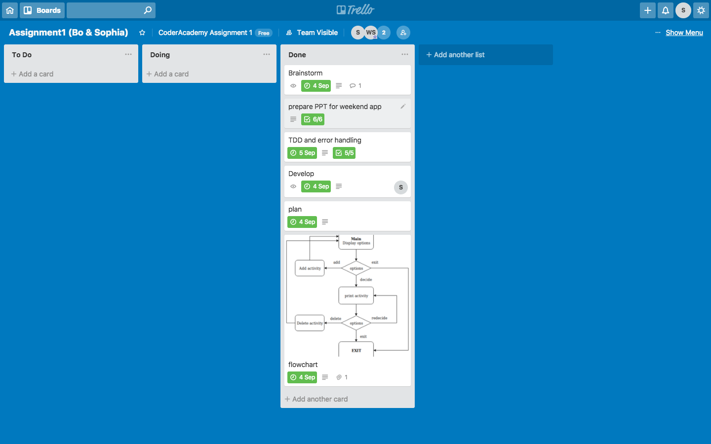

## GitHub repository
https://github.com/asunanto/TerminalApp-A1-1-

## Description of the app
### Purpose
Not too sure what to do on the weekends? No worries guys those days are over.
This app will help you pick what activities to do on the weekends.

### Functionality
-allows user to pick a fun activity at random
-add activities with a given duration 
-change activity's time
-remove activities they dislike

### Instructions for use
running the app
1) Before running the program, make sure 'DEBUG_MODE=false'in WeekendList.rb
2) execute 'ruby WeekendDecider.rb' to run the file

testing the app with TDD
1) before running 'WeekendDecider_test.rb' make sure 'DEBUG_MODE=true' in WeekendList.rb
2) execute 'ruby WeekendDecider_test.rb' to run the file

### Screenshot

 
### design & planning process 
Documented in trello 

https://trello.com/invite/b/XDRQv9UF/d00f5bbf787e318b2b04a71698db8acd/assignment1-bo-sophia
        
   

